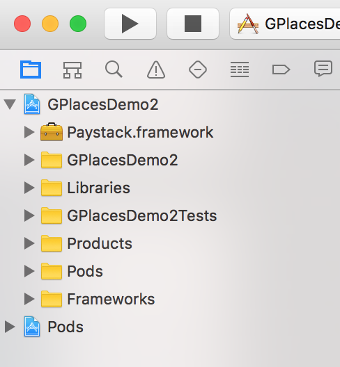
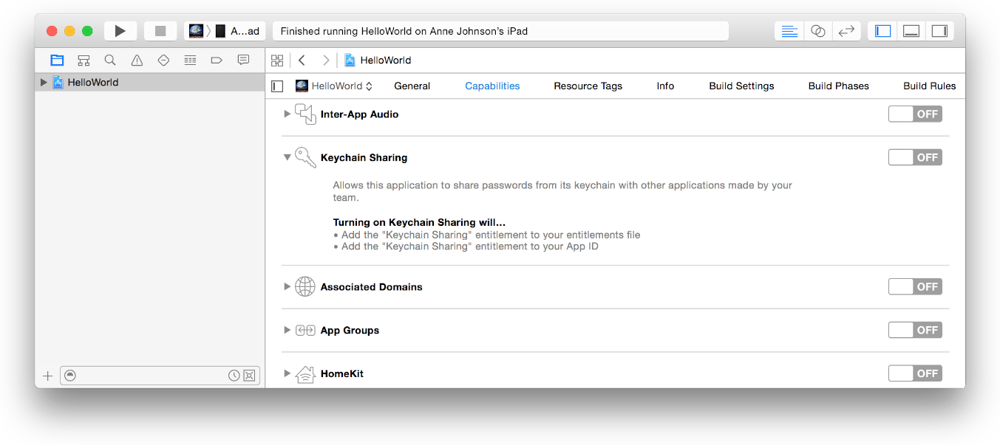

# React Native Wrapper for Paystack Mobile SDKs

for Android & iOS by [Arttitude 360](http://www.arttitude360.com)

## Index

1. [Description](#1-description)
2. [Installation](#2-installation)
3. [Usage](#3-usage)
4. [Credits](#4-credits)
5. [Changelog](#5-changelog)
6. [License](#6-license)

## 1. Description

This React Native module provides a wrapper to add Paystack Payments to your React Native application using the [Paystack Android Mobile SDK](https://github.com/PaystackHQ/paystack-android) and the [Paystack iOS Mobile SDK](https://github.com/PaystackHQ/paystack-ios) libraries. If interested, there is a [Sample App](https://github.com/tolu360/vestarapp).

## 2. Installation

You can pull in react-native-paystack via npm:

```shell
npm install react-native-paystack --save
```
OR 

```shell
yarn add react-native-paystack
```

### Versioning
- For `RN <=0.39` use version 2+ e.g. react-native-paystack@2.2.0 (No longer updated)
- For `RN >=0.40` use version 3+ e.g. react-native-paystack@3.1.4

### Configuration

#### Automatic (iOS & Android)

```shell
react-native link react-native-paystack 
```
- (iOS only): The next steps are necessary for iOS at this time as publishing to NPM seems to break symlinks contained in the Paystack iOS framework shipped with this package, thus causing XCode build errors.
- Download a fresh copy of the `Paystack iOS framework` from their [releases page on Github](https://github.com/PaystackHQ/paystack-ios/releases/).
- Extract `Paystack.framework` from the downloaded zip.
- In XCode's "Project navigator", right click on project name folder ➜ `Add Files to <Your-Project-Name>`. Ensure `Copy items if needed` and `Create groups` are checked and select your copy of `Paystack.framework`.
- Your files tree in XCode should look similar to the screenshot below:



- If you are working with XCode 8+, to allow encryptions work properly with the Paystack SDK, you may need to enable `Keychain Sharing` for your app. In the Capabilities pane, if Keychain Sharing isn’t enabled, toggle ON the switch in the Keychain Sharing section.



#### Manual Config (iOS)

- The following steps are optional, should be taken if you have not run `react-native link react-native-paystack` already.
- In XCode's "Project navigator", right click on project name folder ➜ `Add Files to <...>`. Ensure `Copy items if needed` and `Create groups` are checked
- Go to `node_modules` ➜ `react-native-paystack/ios` ➜ add `RNPaystack.xcodeproj`.

#### Manual Config (Android)

- The following steps are optional, should be taken if you have not run `react-native link react-native-paystack` already.
- Add the following in your `android/settings.gradle` file:

```java
include ':react-native-paystack'
project(':react-native-paystack').projectDir = new File(rootProject.projectDir, '../node_modules/react-native-paystack/android')
```
- Add the following in your `android/app/build.grade` file:

```java
dependencies {
    ...
    compile project(':react-native-paystack')
}
```
- Add the following in your `...MainApplication.java` file:

```java
import com.arttitude360.reactnative.rnpaystack.RNPaystackPackage;

@Override
protected List<ReactPackage> getPackages() {
  return Arrays.<ReactPackage>asList(
      new MainReactPackage(),
      ...
      new RNPaystackPackage() //<-- Add line
  );
}
``` 

#### More Config (Android v3.1.4+)
- Update Gradle plugin to v3.0.0 for your app, follow the following steps if you are not sure how:
  * Edit your `~ android/build.gradle` to look similar to [build.gradle](https://github.com/tolu360/vestarapp/blob/master/android/build.gradle)
  * Edit your `~ android/gradle/wrapper/gradle-wrapper.properties` to look similar to [gradle-wrapper.properties](https://github.com/tolu360/vestarapp/blob/master/android/gradle/wrapper/gradle-wrapper.properties)

- Update your Android build tools and environment to v27+ after the Gradle plugin update
  * Edit your `~ android/app/build.gradle` to look similar to [build.gradle](https://github.com/tolu360/vestarapp/blob/master/android/app/build.gradle)


## 3. Usage

### Import Library
- For ios, edit your `AppDelegate.m` file and import the Paystack framework:

```Objective-C
#import <Paystack/Paystack.h>
...
- (BOOL)application:(UIApplication *)application didFinishLaunchingWithOptions:(NSDictionary *)launchOptions
{
  ...
  
  [Paystack setDefaultPublicKey:@"INSERT-PUBLIC-KEY-HERE"];
  ...

}
```

- For Android, add the following tag in your `android/app/src/main/AndroidManifest.xml` file within the `<application></application>` tags:

```xml
  <meta-data android:name="co.paystack.android.PublicKey" android:value="INSERT-PUBLIC-KEY-HERE"/>
```

### Charging a Card with Access Code (iOS & Android)
It's a cinch to charge a card token using the react-native-paystack module. This is the recommended or the most-preferred workflow favored by the folks at Paystack. Initiate a new transaction on your server side using the appropriate [Paystack endpoint](https://developers.paystack.co/reference#initialize-a-transaction) - obtain an `access_code` and complete the charge on your mobile application. Pls note, the SDK assumes you are responsible for building the card form/UI.

```javascript
	RNPaystack.chargeCardWithAccessCode(cardParams);
```
To be more elaborate, `cardParams` is a Javascript `Object` representing the card to be charged and `RNPaystack.chargeCardWithAccessCode()` returns a Javascript `Promise` like:

```js
import RNPaystack from 'react-native-paystack';

chargeCard() {

	RNPaystack.chargeCardWithAccessCode({
      cardNumber: '4123450131001381', 
      expiryMonth: '10', 
      expiryYear: '17', 
      cvc: '883',
      accessCode: '2p3j42th639duy4'
    })
	.then(response => {
	  console.log(response); // do stuff with the token
	})
	.catch(error => {
	  console.log(error); // error is a javascript Error object
	  console.log(error.message);
	  console.log(error.code);
	})
	
}
```

#### Request Signature

| Argument        | Type           | Description  |
| ------------- |:-------------:| :-----|
| cardNumber          | string | the card number as a String without any seperator e.g 5555555555554444 |
| expiryMonth      | string      | the card expiry month as a double-digit ranging from 1-12 e.g 10 (October) |
| expiryYear | string      | the card expiry year as a double-digit e.g 15 |
| cvc | string | the card 3/4 digit security code as a String e.g 123 |
| accessCode | string | the access_code obtained for the charge |

#### Response Object

An object of the form is returned from a successful token request

```javascript
{
	reference: "trx_1k2o600w"
}
```

### Charging a Card (iOS & Android)
Using the react-native-paystack module, you can start and complete a transaction with the mobile Paystack Android and iOS SDKs. With this option, you pass both your charge and card properties to the SDK - with this worklow, you initiate and complete a transaction on your mobile app. Note that as with charging with an access_code, the SDK assumes you are responsible for building the card form/UI.

```javascript
RNPaystack.chargeCard(chargeParams);
```
To be more elaborate, `chargeParams` is a Javascript `Object` representing the parameters of the charge to be initiated and `RNPaystack.chargeCard()` returns a Javascript `Promise` like:

```js
import RNPaystack from 'react-native-paystack';

chargeCard() {

	RNPaystack.chargeCard({
      cardNumber: '4123450131001381', 
      expiryMonth: '10', 
      expiryYear: '17', 
      cvc: '883',
      email: 'chargeIOS@master.dev',
      amountInKobo: 150000,
      subAccount: 'ACCT_pz61jjjsslnx1d9',
    })
	.then(response => {
	  console.log(response); // card charged successfully, get reference here
	})
	.catch(error => {
	  console.log(error); // error is a javascript Error object
	  console.log(error.message);
	  console.log(error.code);
	})
	
}
```

#### Request Signature (chargeParams)

| Argument        | Type           | Description  |
| ------------- |:-------------:| :-----|
| cardNumber          | string | the card number as a String without any seperator e.g 5555555555554444 |
| expiryMonth      | string      | the card expiry month as a double-digit ranging from 1-12 e.g 10 (October) |
| expiryYear | string      | the card expiry year as a double-digit e.g 15 |
| cvc | string | the card 3/4 digit security code as e.g 123 |
| email | string | email of the user to be charged |
| amountInKobo | integer | the transaction amount in kobo |
| currency (optional) | string | sets the currency for the transaction e.g. USD |
| plan (optional) | string | sets the plan ID if the transaction is to create a subscription e.g. PLN_n0p196bg73y4jcx |
| subAccount (optional) | string | sets the subaccount ID for split-payment transactions e.g. ACCT_pz61jjjsslnx1d9 |
| transactionCharge (optional) | integer | the amount to be charged on a split-payment, use only when `subAccount` is set |
| bearer (optional) | string | sets which party bears paystack fees on a split-payment e.g. 'subaccount', use only when `subAccount` is set |
| reference (optional) | string | sets the transaction reference which must be unique per transaction |

#### Response Object

An object of the form is returned from a successful charge

```javascript
{
	reference: "trx_1k2o600w"
}
```

### Verifying a Charge
Verify a charge by calling Paystack's [REST API](https://api.paystack.co/transaction/verify) with the `reference` obtained above. An `authorization_code` will be returned once the card has been charged successfully. Learn more about that [here](https://developers.paystack.co/docs/verify-transaction).

 **Parameter:** 

 - reference  - the transaction reference (required)

 **Example**

 ```bash
 $ curl https://api.paystack.co/transaction/verify/trx_1k2o600w \
    -H "Authorization: Bearer SECRET_KEY" \
    -H "Content-Type: application/json" \
    -X GET
 ```

## 4. CREDITS

Perhaps needless to say, this module leverages the [Paystack Android SDK](https://github.com/PaystackHQ/paystack-android) and the [Paystack IOS SDK](https://github.com/PaystackHQ/paystack-ios) for all the heavy liftings.

## 5. CHANGELOG

+ 1.0.12: Initial version supporting Android.
+ 1.1.1: Android library upgrade and initial iOS support.
+ 2.0.0: A couple of breaking changes have been introduced, see [Old Docs](./Old Docs.md) for previous documentations.
+ 2.0.0: Upgraded to v2.0 of the Paystack Android SDK.
+ 2.0.0: Unified APIs across both platforms (iOS & Android).
+ 2.0.0: Methods now return Javascript Promises on both platforms.
+ 2.1.1: Upgraded to v2.1+ of both the Paystack iOS and Android SDKs.
+ 2.1.1: Added support for `chargeCard` on both platforms.
+ 2.1.1: Added support for `subscriptions` and `split-payments`.
+ 3.1.0: Retired support for `getToken` on both platforms.
+ 3.1.0: Added support for `chargeCardWithAccessCode` on both platforms.
+ 3.1.0: Upgraded to v3.*+ of both the Paystack iOS and Android SDKs.
+ 3.1.1: Fix for breaking change in RN v0.47+
* 3.1.4: Miscellaneous and dependencies update on Android

## 6. License

 This should be [The MIT License (MIT)](http://www.opensource.org/licenses/mit-license.html). I would have to get back to you on that!

